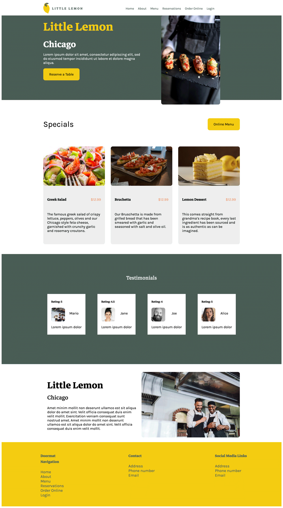

# Little Lemon Capstone Project

## Technologies

-   HTML
-   CSS
-   JavaScript
-   ReactJS

## Description

This is the final capstone project of the Meta Frontend Developer Certification course found on <a href="https://www.coursera.org/professional-certificates/meta-front-end-developer" target="_blank">Coursera</a>

## Users Can:

Browse the site and book a reservation a

## Developed by

Mouhamadou Diouf ( <a href="https://github.com/MouhaDiouf"> @mouhad </a>)

Let's connect on:

-   <a href="https://www.linkedin.com/in/mouha-diouf/" target="_blank" > LinkedIn </a>
-   <a href="https://twitter.com/mouhamadiouf" target="_blank"> Twitter</a>

<!-- You can also check <a href="https://mouhadiouf.com/" target="_blank"> my portfolio </a> -->

## How to start the game

1. Clone it (git clone git@github.com:MouhaDiouf/meta-capstone.git)
2. run the command: npm i & npm start (from your code editor's terminal or any other terminal)

## Potential Future Improvements

-   Build a login system
-   Save data in a database

## Contributing

1. Fork it (https://github.com/MouhaDiouf/meta-capstone)
2. Create your feature branch (git checkout -b feature/[choose-a-name])
3. Commit your changes (git commit -am 'What this commit will fix/add')
4. Push to the branch (git push origin feature/[chosen name])
5. Create a new Pull Request
